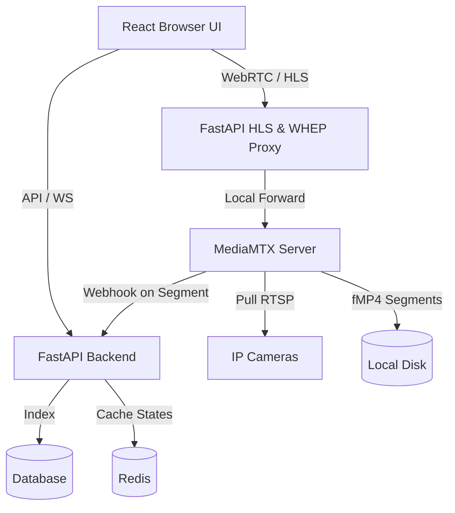

# Camera Video Platform API & WebSockets Documentation

This document describes the architecture, functionality, and endpoints of the video management system (VMS) backend.

---

## System Architecture Overview

The platform uses a decoupled, event-driven media streaming architecture:
1. **FastAPI Backend**: Acts as the central controller, database interface (SQLite/Postgres), and API proxy.
2. **MediaMTX Media Server**: Handles RTSP stream pulling, WebRTC (WHEP/WHIP) signaling, and fMP4 continuous recording.
3. **Redis**: Manages real-time cache (viewer counts, active stream states).
4. **PostgreSQL/SQLite**: Persists camera registries, recording segments, and session histories.

---

## 1. Camera Sync & Directory APIs

### `POST /api/cameras/sync` & `GET /api/cameras/sync`
- **Functionality**: Dynamically fetches the camera configuration registry from the upstream API.
- **Workflow**:
  1. Queries the upstream URL configured in `.env` (`UPSTREAM_CAMERA_API_URL`).
  2. Syncs/upserts camera parent rows in the database.
  3. Maps the streams (`MAIN` or `SUB` profiles) based on stream type.
  4. Automatically adds or removes paths in the MediaMTX live configuration using its REST API.
  5. Determines if a stream should be `always_on` (continuous recording) based on whether `archiveDays > 0`.
- **Response**: `SyncResponse` containing the total camera count, updated count, and upstream source.

### `GET /api/cameras?sync={true/false}`
- **Functionality**: Returns a list of all registered cameras, their streams, profiles, and active statuses.
- **Query Parameter**: If `sync=true`, the backend performs an upstream synchronization loop before returning the list.

### `GET /api/cameras/{stream_id}`
- **Functionality**: Retrieves metadata, active stream profile, resolution, FPS, and status for a single camera stream.

---

## 2. Live Stream Management APIs

### `POST /api/cameras/{stream_id}/live/start`
- **Functionality**: Instructs the stream manager to start pulling the live RTSP feed from the camera.
- **Workflow**: Adds the path and source RTSP URL dynamically to the MediaMTX configuration.

### `POST /api/cameras/{stream_id}/live/stop`
- **Functionality**: Stops the stream and frees resources.
- **Workflow**: Deletes the path config from the MediaMTX daemon.

### `POST /api/cameras/{stream_id}/live/restart`
- **Functionality**: Performs a hard reload of the RTSP stream. Used when the stream is stuck or experiencing packet loss.

---

## 3. Media Streaming & Signaling Proxies

To prevent CORS issues and secure credentials, the backend proxies all media requests to MediaMTX.

### `GET /api/streams/{stream_id}/live/index.m3u8`
- **Functionality**: Proxies HLS playlist index requests to MediaMTX HLS engine (`port 8080`).
- **Headers**: Injects strict cache-control headers (`no-cache`) to ensure the browser doesn't cache live playlists.

### `GET /api/streams/{stream_id}/live/{filename}`
- **Functionality**: Proxies individual TS (`.ts`) or fMP4 (`.mp4`) HLS segments. Matches content types accordingly (`video/MP2T` or `video/mp4`).

### `POST /api/streams/{stream_id}/live/whep?user_id={uuid}`
- **Functionality**: Proxies WebRTC **WHEP (WebRTC HTTP Egress Protocol)** signaling offers.
- **Workflow**:
  1. Validates that WebRTC is enabled and viewer limits are not exceeded.
  2. Forwards the browser's SDP offer to MediaMTX (`port 8889`).
  3. Receives the SDP answer from MediaMTX.
  4. Registers the session in the database as `ACTIVE` and adds the subscriber to the Redis viewer tracker.
  5. Rewrites the MediaMTX `Location` header to return a proxied session endpoint: `/api/streams/{stream_id}/live/whep/{session_id}`.

### `PATCH /api/streams/{stream_id}/live/whep/{session_id}`
- **Functionality**: Handles trickle ICE candidates sent from the browser to negotiate connection routes.

### `DELETE /api/streams/{stream_id}/live/whep/{session_id}`
- **Functionality**: Terminates the WebRTC connection, frees the socket in MediaMTX, marks the session as `CLOSED` in the database, and decrements the Redis subscriber count.

### `POST /api/webrtc/play/{camera_id}?user_id={uuid}`
- **Functionality**: Proxies WebRTC **WHEP** signaling offers for a specific camera ID (corresponds to `stream_id` in the DB).
- **Key Features**: 
  - `user_id` query parameter is completely optional. If not provided, a random UUID is generated automatically.
  - Rewrites the `Location` header to use the `/api/webrtc/play` prefix: `/api/webrtc/play/{camera_id}/{session_id}`.

### `POST/PATCH/DELETE /api/webrtc/play/{camera_id}/{session_id}`
- **Functionality**: Handles trickle ICE candidates and session teardowns for the WHEP play sessions created using the `/api/webrtc/play/{camera_id}` endpoint.

---

## 4. Playback & Recording APIs

### `POST /api/recordings/segment-complete`
- **Functionality**: Webhook endpoint invoked automatically when a new fMP4 segment completes recording.
- **Workflow**:
  1. The MediaMTX daemon triggers `segment_hook.sh` upon completing a 60-second clip.
  2. The hook script POSTs to this endpoint containing the stream ID and absolute file path on disk.
  3. The backend validates the file, calculates the duration using `ffprobe`, computes the start/end timestamps, and registers the segment in the `recording_segments` database table.

### `GET /api/playback/{stream_id}?start_ts={ts}&end_ts={ts}`
- **Functionality**: Returns a list of all indexed recording segments on disk matching the requested timestamp range.

### `GET /api/playback/{stream_id}/available-dates`
- **Functionality**: Returns a sorted list of dates (format: `YYYY-MM-DD`) where recordings exist for the camera.

### `GET /api/playback/{stream_id}/timeline?date={YYYY-MM-DD}`
- **Functionality**: Compiles a detailed daily coverage timeline.
- **Functionality**: Divides the day into active intervals and identifies **recording gaps** (periods where the camera went offline and missed recording).

### `GET /api/playback/{stream_id}/stream.mp4?start_ts={ts}&end_ts={ts}`
- **Functionality**: Generates a continuous playback video stream for the selected time range.
- **Workflow**:
  1. Queries the segments spanning the requested time range.
  2. Dynamically builds a temporary text file listing these file paths.
  3. Launches a sub-process running FFmpeg with the `concat` demuxer and `copy` codecs.
  4. Streams the unified fragmented MP4 (`fmp4`) directly back to the browser's HTML5 `<video>` tag with support for range requests (bytes).

### `GET /api/playback/{camera_id}/play?start_ts={ts}&end_ts={ts}`
- **Functionality**: Serves dynamic MP4 playback video streaming for a camera ID (corresponds to `stream_id` in the DB) matching the start/end timestamps.

---

## 5. WebSockets

### `WS /ws/status`
- **Functionality**: A persistent WebSocket connection that broadcasts real-time camera state changes and subscriber metrics to the frontend.
- **Execution**:
  - Automatically queries Redis and the database every `ui_poll_seconds` (default: 5 seconds).
  - Sends a JSON payload detailing each camera's current status (`ONLINE`, `OFFLINE`, `CONNECTING`) and the count of active WebRTC subscribers.
  - Keeps the connection alive by handling ping-pong packets.

---

## 6. ICE Servers & WebRTC Stats

### `GET /api/webrtc/ice-servers`
- **Functionality**: Returns the list of STUN and TURN server URLs and credentials so the browser can negotiate WebRTC peer connections.

### `POST /api/webrtc/streams/{stream_id}/stats`
- **Functionality**: Browsers periodically post WebRTC connection stats (FPS, bitrate, RTT, packet loss, decoder latency, and dropped frames) to this endpoint.
- **Storage**:
  - Saves the real-time snapshot in Redis (with a 30-second TTL) for the admin dashboard.
  - Writes metrics to the historical database for performance audit logs.

### `GET /api/webrtc/streams/{stream_id}/stats`
- **Functionality**: Aggregates the statistics of all active viewers on a stream to display average latency and packet loss.
