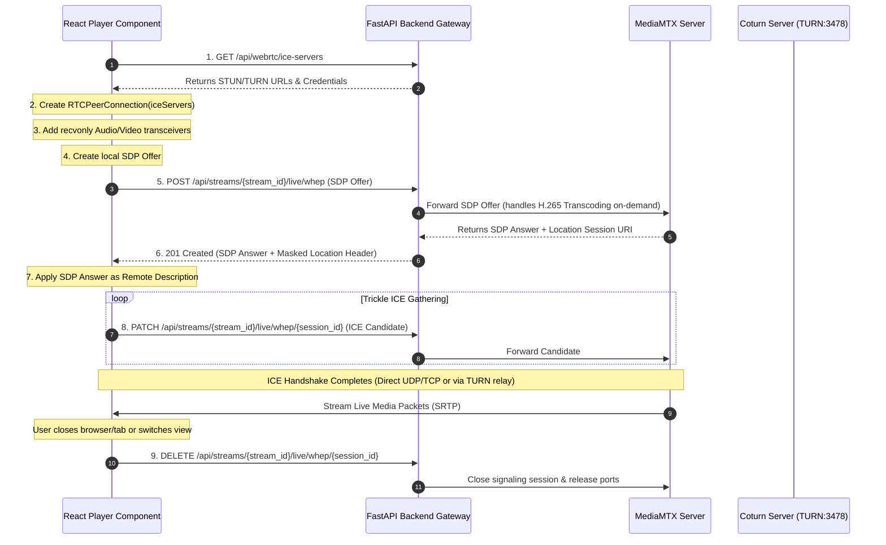

# Frontend WebRTC (WHEP) Player Integration Guide

This document provides a detailed, step-by-step guide for UI developers on how to integrate the ultra-low-latency WebRTC (WHEP) live video player with HLS backup fallback in the frontend.

---

## 1. Protocol Negotiation Flow

WebRTC egress uses the standard **WHEP (WebRTC HTTP Egress Protocol)**. Since browsers do not initiate WebRTC media streaming directly, a signaling exchange must occur between the client browser and the FastAPI gateway (acting as a secure proxy to MediaMTX).



---

## 2. Step-by-Step Implementation Steps

### Step 2.1: Retrieve ICE Server Configuration
Query the backend to get the latest STUN and TURN credentials:
```typescript
const response = await fetch('/api/webrtc/ice-servers');
const { iceServers } = await response.json();
```
*Response payload format:*
```json
{
  "iceServers": [
    { "urls": ["stun:stun.l.google.com:19302"] },
    { 
      "urls": ["turn:172.20.100.235:3478"], 
      "username": "admin", 
      "credential": "admin123" 
    }
  ]
}
```

### Step 2.2: Initialize the Peer Connection
Instantiate the `RTCPeerConnection` with the fetched servers. Create transceivers to indicate that the browser will only **receive** video and audio tracks (egress-only connection).
```typescript
const pc = new RTCPeerConnection({ iceServers });

// Add recvonly transceivers
pc.addTransceiver('video', { direction: 'recvonly' });
pc.addTransceiver('audio', { direction: 'recvonly' });
```

### Step 2.3: Handle Inbound Tracks
Bind an `ontrack` listener to route the incoming stream into the HTML5 `<video>` tag:
```typescript
pc.ontrack = (event) => {
  const videoElement = document.getElementById('my-video-element') as HTMLVideoElement;
  if (videoElement && event.streams && event.streams[0]) {
    videoElement.srcObject = event.streams[0];
    videoElement.play().catch(err => console.log("Play interrupted:", err));
  }
};
```

### Step 2.4: Create Local Description (Offer)
Create the SDP offer and set it as the local description:
```typescript
const offer = await pc.createOffer();
await pc.setLocalDescription(offer);
```

### Step 2.5: WHEP Session Handshake (POST)
Send the local SDP offer string to the backend. Generate or supply a unique `user_id` query parameter for session tracking.
```typescript
const user_id = "some-unique-uuid"; // e.g. from crypto.randomUUID()
const whepResponse = await fetch(`/api/streams/${streamId}/live/whep?user_id=${user_id}`, {
  method: 'POST',
  headers: { 'Content-Type': 'application/sdp' },
  body: offer.sdp
});

if (!whepResponse.ok) {
  throw new Error(`Signaling failed: ${whepResponse.statusText}`);
}

// 1. Save WHEP session URL from Location header for PATCH/DELETE actions
const sessionUrl = whepResponse.headers.get('Location'); 

// 2. Set the returned SDP answer as the remote description
const answerSdp = await whepResponse.text();
await pc.setRemoteDescription(new RTCSessionDescription({
  type: 'answer',
  sdp: answerSdp
}));
```

### Step 2.6: Trickle ICE Candidates (PATCH)
ICE candidates are gathered asynchronously. Send each candidate as an SDP fragment to the session URL obtained in the previous step:
```typescript
pc.onicecandidate = (event) => {
  if (event.candidate && sessionUrl) {
    fetch(sessionUrl, {
      method: 'PATCH',
      headers: { 'Content-Type': 'application/trickle-ice-sdpfrag' },
      body: event.candidate.candidate
    }).catch(err => console.error("Trickle ICE error:", err));
  }
};
```

### Step 2.7: Resource Cleanup (DELETE)
When the user navigates away, closes the player, or switches grid configurations, release the media streams and terminate the signaling session to prevent connection leaks on MediaMTX and transcoders:
```typescript
if (pc) {
  if (sessionUrl) {
    fetch(sessionUrl, { method: 'DELETE' }).catch(() => {});
  }
  pc.close();
}
```

---

## 3. Intelligent HLS Fallback Strategy

WebRTC connections may fail due to restrictive corporate firewalls blocking UDP/TURN ports. A robust player must implement an automatic fallback to HLS (HTTP Live Streaming) manifests:
1. **Connection Timeout**: Start a **10-second timer** when initializing the WebRTC connection.
2. **Success**: Clear the timer once the `ontrack` callback triggers and video begins playing.
3. **Failure**: If the timer expires or the WHEP request returns an error (such as a transcoding capacity error, HTTP 503), switch the player's source to the HLS playlist:
   `/api/streams/{stream_id}/live/stream.m3u8`

---

## 4. Querying WebRTC Connection Statistics

To build stats diagnostics overlays (HUD) on the UI, retrieve browser WebRTC parameters via the `RTCPeerConnection.getStats()` API:
```typescript
const stats = await pc.getStats();
stats.forEach((report) => {
  if (report.type === 'inbound-rtp' && report.mediaType === 'video') {
    const bytesReceived = report.bytesReceived;
    const framesDecoded = report.framesDecoded;
    const jitter = report.jitter * 1000; // converted to ms
    const packetsLost = report.packetsLost;
    console.log(`Bitrate stats: Packets Lost: ${packetsLost}, Jitter: ${jitter}ms`);
  }
  if (report.type === 'candidate-pair' && report.state === 'succeeded') {
    const rtt = report.currentRoundTripTime * 1000; // converted to ms
    console.log(`Network latency (RTT): ${rtt}ms`);
  }
});
```
To help the control plane optimize transcoding and monitoring, the UI should POST these stats back to the backend every 5 seconds:
`POST /api/webrtc/streams/{stream_id}/stats`
```json
{
  "session_id": "session-uuid",
  "fps": 25.0,
  "bitrate": 1024.5,
  "rtt": 45.2,
  "packet_loss": 0.001,
  "jitter": 2.5,
  "frames_dropped": 0,
  "resolution": "1920x1080"
}
```
