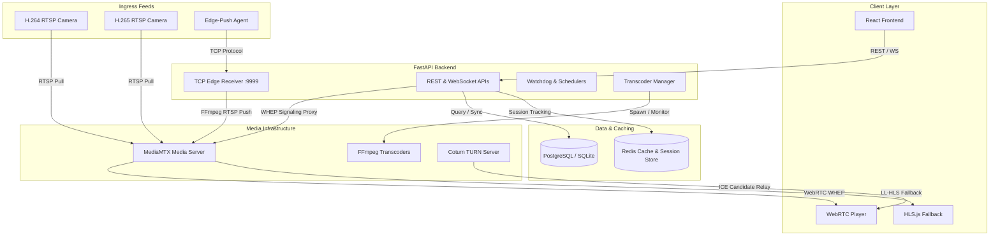

# Video Management System (VMS) - Tech Stack Documentation

This document provides a comprehensive overview of the end-to-end technology stack utilized in the Video Management System (VMS) project. It details the purpose of each component, how they are used, and links to the relevant parts of the codebase.

---

## Architecture Overview

The VMS architecture is designed to orchestrate camera feeds, transcode high-efficiency video on-demand, record raw streams, and deliver sub-second latency video to modern web browsers.

---

## 1. Frontend Web Interface

The frontend is a modern single-page application designed for real-time video grid monitoring, recording playback, camera administration, and camera health reporting.

| Technology | Purpose / Use Case | Integration in Project |
| :--- | :--- | :--- |
| **React (v18.3.1)** | Provides a component-driven architecture for rapid UI updates and interactive dashboards. | Used as the UI framework throughout `frontend/src/`. Main shell configured in [App.tsx](file:///c:/Users/santhosh/Downloads/vs/camera_video_platform_fullstack/frontend/src/App.tsx). |
| **TypeScript (v5.6.3)** | Enables compile-time type-safety, preventing interface inconsistencies between frontend structures and backend API payloads. | Type schemas are maintained in [types.ts](file:///c:/Users/santhosh/Downloads/vs/camera_video_platform_fullstack/frontend/src/types.ts). |
| **Vite (v5.4.8)** | Acts as a high-speed development server and production bundler, using native ES modules for fast Hot Module Replacement (HMR). | Configured in [vite.config.ts](file:///c:/Users/santhosh/Downloads/vs/camera_video_platform_fullstack/frontend/src/vite.config.ts). |
| **WebRTC API** | Provides sub-second latency video playback directly in the browser without plugins, using the WebRTC HTTP Egress Protocol (WHEP). | Handled in [WebRTCPlayer.tsx](file:///c:/Users/santhosh/Downloads/vs/camera_video_platform_fullstack/frontend/src/components/WebRTCPlayer.tsx). |
| **hls.js (v1.5.15)** | Serves as the fallback player engine when WebRTC connections fail or when the transcoder capacity limit is reached. | Handled in [Player.tsx](file:///c:/Users/santhosh/Downloads/vs/camera_video_platform_fullstack/frontend/src/components/Player.tsx) for streaming Low-Latency HLS. |
| **Lucide React (v0.453.0)**| Supplies clean, modern SVG vector icons for UI elements. | Used globally across tabs (e.g. [Sidebar.tsx](file:///c:/Users/santhosh/Downloads/vs/camera_video_platform_fullstack/frontend/src/components/Sidebar.tsx)). |
| **Vanilla CSS** | Defines the aesthetics, including a premium glassmorphic dark mode, transitions, responsive layouts, and grid structures. | Managed globally in [styles.css](file:///c:/Users/santhosh/Downloads/vs/camera_video_platform_fullstack/frontend/src/styles.css). |

---

## 2. Backend & API Controller

The backend is built around FastAPI to handle high-concurrency requests, asynchronous operations, streaming handshakes, and process control.

| Technology | Purpose / Use Case | Integration in Project |
| :--- | :--- | :--- |
| **FastAPI (v0.115.0)** | Serves REST endpoints for camera config, triggers syncs, queries recording timelines, and proxies WebRTC signaling. | Configured in [main.py](file:///c:/Users/santhosh/Downloads/vs/camera_video_platform_fullstack/backend/app/main.py) with routers for cameras, streams, and signaling. |
| **Uvicorn (v0.30.6)** | High-performance ASGI web server that runs the FastAPI application. | Used to spin up the backend server (host: `0.0.0.0`, port: `8000`). |
| **Pydantic Settings** | Validates configuration settings and maps OS environment variables to Python objects. | Configured in [config.py](file:///c:/Users/santhosh/Downloads/vs/camera_video_platform_fullstack/backend/app/config.py) to manage transcoding policies, db strings, and media credentials. |
| **httpx (v0.27.2)** | Asynchronous HTTP client used to fetch remote cameras or query MediaMTX’s control APIs. | Used in [upstream.py](file:///c:/Users/santhosh/Downloads/vs/camera_video_platform_fullstack/backend/app/upstream.py) to pull configuration from remote sync targets. |
| **aiofiles (v24.1.0)** | Asynchronous file I/O operations to prevent blocking the async loop when accessing disks. | Used in config backup writes, timeline exports, and disk audits. |

---

## 3. Storage & Relational Database Layer

The storage layer tracks camera records, video streams, recording segments, and active user sessions.

| Technology | Purpose / Use Case | Integration in Project |
| :--- | :--- | :--- |
| **SQLAlchemy (v2.0.34)** | Python SQL Toolkit and ORM supporting both synchronous and asynchronous operations. | Models defined in [models.py](file:///c:/Users/santhosh/Downloads/vs/camera_video_platform_fullstack/backend/app/models.py). Session instantiation setup in [db.py](file:///c:/Users/santhosh/Downloads/vs/camera_video_platform_fullstack/backend/app/db.py). |
| **Alembic (v1.13.1)** | Automates relational schema generation and database migration tracking. | Configured via `alembic.ini` and scripts inside the `alembic` folder to structure the schema incrementally. |
| **SQLite / aiosqlite** | Serves as the lightweight database engine for local development and edge deployments. | Selected dynamically based on `DATABASE_URL` setup. Handled asynchronously using `aiosqlite`. |
| **PostgreSQL / asyncpg** | High-performance, production-ready relational database target for large deployments. | Leverages the async driver `asyncpg` and binary driver `psycopg2-binary` to manage active DB queries in production. |

---

## 4. Media Streaming & Processing Infrastructure

This layer is responsible for media ingress, egress, NAT traversal, and real-time transcoding.

| Technology | Purpose / Use Case | Integration in Project |
| :--- | :--- | :--- |
| **MediaMTX (v1.9.0)** | High-performance, multi-protocol media server. Handles RTSP streams, records MP4 fragments, and publishes WebRTC (WHEP) and HLS feeds. | Configured in `mediamtx_linux.yml` and monitored/instructed via [mediamtx_client.py](file:///c:/Users/santhosh/Downloads/vs/camera_video_platform_fullstack/backend/app/mediamtx_client.py). |
| **FFmpeg** | Handles raw stream transcoding. Because browsers don't natively support H.265/HEVC over WebRTC, the backend spawns FFmpeg to convert H.265 to H.264 on-demand. | Core transcoding lifecycle logic (spawning, process management, and CPU protections) is defined in [transcoder.py](file:///c:/Users/santhosh/Downloads/vs/camera_video_platform_fullstack/backend/app/transcoder.py). |
| **Coturn (TURN/STUN)** | Handles NAT traversal for WebRTC. Generates TURN configurations so players can establish media streams across different network subnets. | WebRTC module [webrtc.py](file:///c:/Users/santhosh/Downloads/vs/camera_video_platform_fullstack/backend/app/webrtc.py) serves STUN/TURN credentials to the client via `/api/webrtc/ice-servers`. |
| **Custom TCP Receiver** | A custom socket server built in python's `asyncio.start_server` to listen for inbound proprietary video feeds on port `9999`. | Implemented in [edge_receiver.py](file:///c:/Users/santhosh/Downloads/vs/camera_video_platform_fullstack/backend/app/edge_receiver.py). It reads header metadata, remuxes frames using FFmpeg, and pushes them to MediaMTX. |

> [!NOTE]
> **On-Demand Transcoding Lifecycle**:
> - When a viewer plays an H.265 feed, the backend checks for an existing transcoder session. If none exists, it spawns an FFmpeg process.
> - Multiple viewers of the same stream share a single FFmpeg process to optimize CPU usage.
> - When the last viewer disconnects, a 60-second grace period triggers. If no new viewer connects, the process terminates.

---

## 5. Coordination & Caching Layer

Coordinates state sharing, distributed lock management, and real-time event distribution.

| Technology | Purpose / Use Case | Integration in Project |
| :--- | :--- | :--- |
| **Redis (v5.0.3)** | Provides in-memory key-value storage and Pub/Sub mechanics for multi-instance process synchronization. | Managed in [redis_client.py](file:///c:/Users/santhosh/Downloads/vs/camera_video_platform_fullstack/backend/app/redis_client.py) using the `redis-py` library. |
| **Redis Viewer Tracker** | Maintains real-time reader locks and active browser session counts for WebRTC streams. | Implemented in [redis_viewer_tracker.py](file:///c:/Users/santhosh/Downloads/vs/camera_video_platform_fullstack/backend/app/redis_viewer_tracker.py). It signals when H.265 transcoders should start or stop. |

---

## 6. Edge Push Agent (edge-push)

A standalone client that runs on remote hardware (e.g. edge gateways) directly connected to local cameras.

| Technology | Purpose / Use Case | Integration in Project |
| :--- | :--- | :--- |
| **Python Standard Sockets** | Establishes low-overhead, persistent TCP socket connections to push raw frame payloads to the central receiver. | Core transmission client defined in [edge-push.py](file:///c:/Users/santhosh/Downloads/edge-push/edge-push/edge-push.py). |
| **ffprobe / FFmpeg** | Analyzes local IP camera RTSP streams to extract media profiles and capture raw NAL units. | Used inside `edge-push.py` to copy video streams (`copy` codec) without re-encoding to save edge resources. |
| **Custom TCP Protocol** | Encapsulates video payloads (H.264 or H.265 NAL units) with binary headers indicating frame boundary, camera configurations (SPS, PPS, VPS), and frame rate downsampling. | Built into [EdgePushClient](file:///c:/Users/santhosh/Downloads/edge-push/edge-push/edge-push.py#L151) class. |

---

## 7. Production DevOps Stack

The production setup ensures stability, security, reverse proxy routing, and automatic recovery.

| Technology | Purpose / Use Case | Integration in Project |
| :--- | :--- | :--- |
| **Docker & Docker Compose**| Containerizes applications to ensure parity between local development and production environments. | Multi-container composition (FastAPI backend, React frontend, MediaMTX, Redis) configured in [docker-compose.yml](file:///c:/Users/santhosh/Downloads/vs/camera_video_platform_fullstack/docker-compose.yml). |
| **Nginx** | Reverse proxies incoming HTTP/HTTPS traffic to Vite/FastAPI, serves the built static frontend assets, and handles WebSocket connection upgrades (`Upgrade`, `Connection` headers). | Detailed deployment rules are configured in Nginx server blocks as documented in the [Deployment Guide](file:///c:/Users/santhosh/Downloads/vs/camera_video_platform_fullstack/deployment_guide.md#L128). |
| **systemd** | Standard Linux system daemon manager used to run VMS components as reliable background background services. | Services such as `mediamtx.service`, `video-backend.service`, and `video-frontend.service` are installed on the server to handle automatic restarts on failure. |
| **UFW (Uncomplicated Firewall)** | Manages iptables rule sets to lock down non-essential ports while exposing REST APIs (8000), Edge Receiver (9999), RTSP (8554), WebRTC (8889), and TURN (3478). | Documented in [Firewall Configuration Guide](file:///c:/Users/santhosh/Downloads/vs/camera_video_platform_fullstack/deployment_guide.md#L7). |

---

> [!TIP]
> **Performance Tuning Tip**:
> In heavy multi-camera environments, consider using hardware-accelerated transcoding (e.g. NVIDIA's `h264_nvenc` or Intel's `h264_qsv`) instead of the CPU-based `libx264` codec. This can be configured in your environment setup using the `TRANSCODER_VCODEC` setting.
