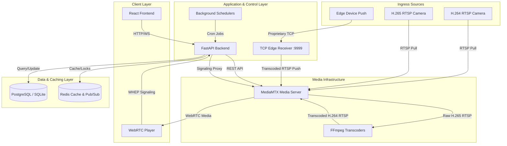
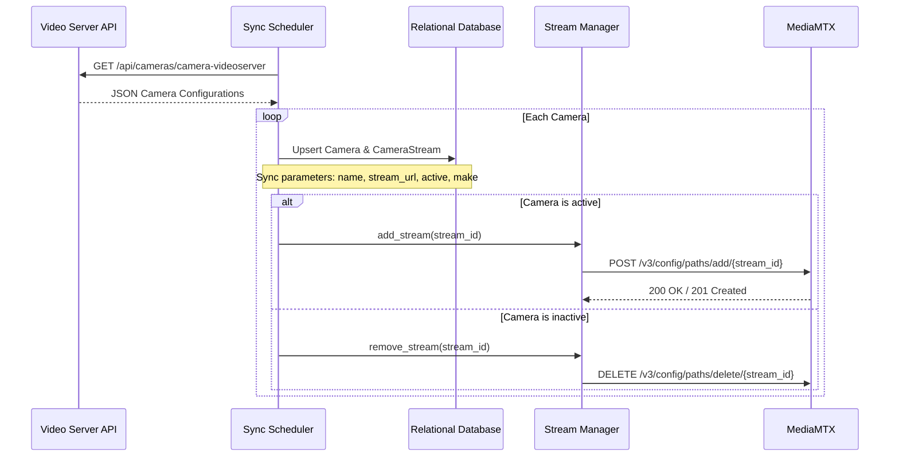
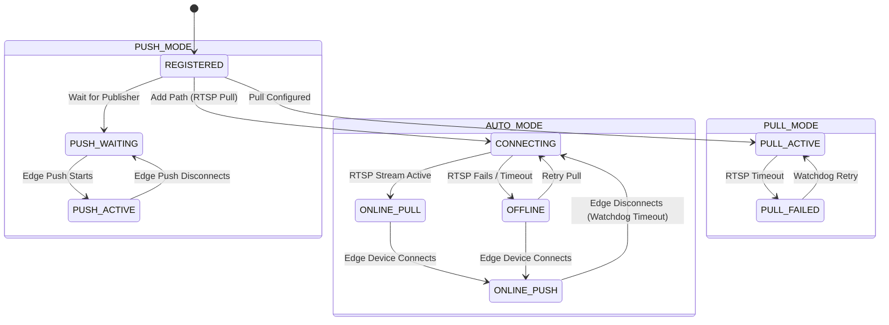
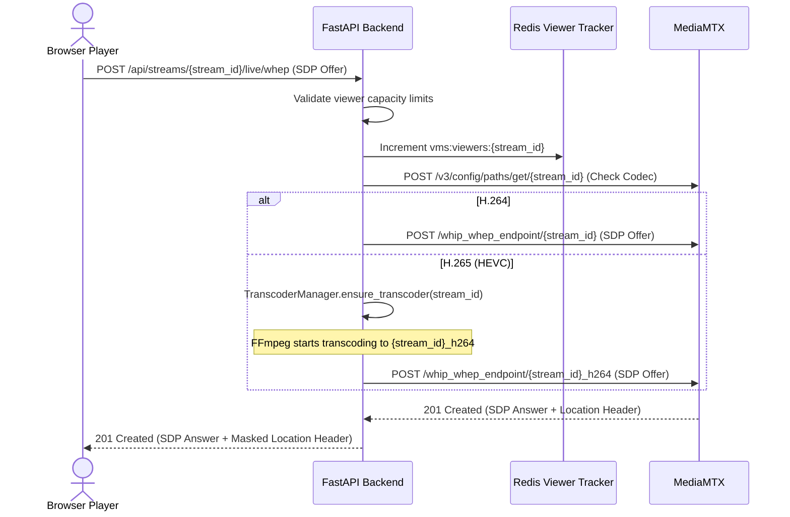
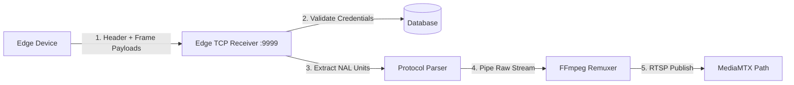
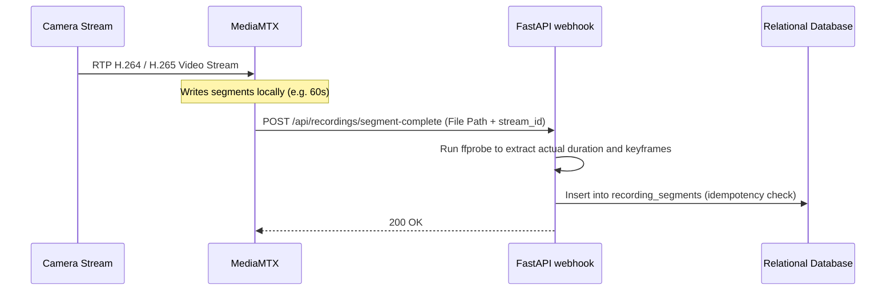
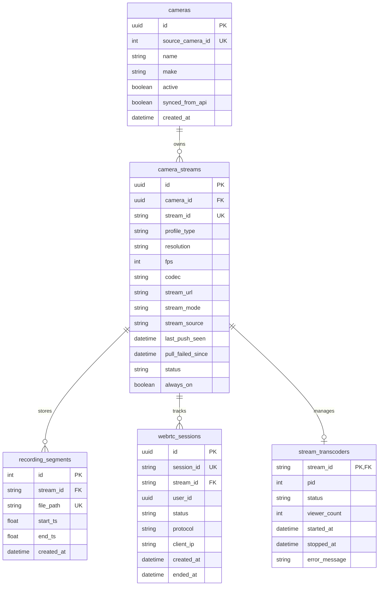

# Enterprise Video Management System (VMS)
## Complete Architecture & Data Flow Documentation

This document serves as the comprehensive, end-to-end technical architecture and data flow specification for the Video Management System (VMS). It details the system's design, request flows, media routing, background operations, database schema, and failover behaviors.

---

## 1. Executive Summary
The VMS is an enterprise-grade, high-performance, and low-latency video streaming and recording platform. It is designed to interface with traditional IP cameras (via RTSP) and custom edge devices (via a custom TCP receiver). The system implements hybrid media management:
- **Low-Latency Live View**: Served via WebRTC (WHEP) for real-time monitoring (<1 second latency).
- **Native Recordings**: Saved as high-fidelity MP4 segments directly from RTSP sources to optimize storage and maintain quality.
- **On-Demand Transcoding**: Translates HEVC/H.265 feeds to H.264 on-demand for browser playback compatibility, dynamically spawning and terminating transcoders to optimize CPU utilization.

---

## 2. System Architecture Overview

The system architecture divides responsibilities across the frontend (React), FastAPI backend, MediaMTX media server, Redis caching/coordination layer, and a PostgreSQL/SQLite persistent database.



---

## 3. Component Responsibilities

### 3.1 Backend (FastAPI)
- **REST APIs**: Manages camera registration, playback schedules, live stream tokens, and system settings.
- **WebRTC Signaling Proxy**: Handles WHEP/WHIP SDP negotiation and proxies requests between clients and MediaMTX.
- **Transcoder Manager**: Dynamically manages FFmpeg transcoding processes for H.265 streams based on active client sessions.
- **Background Schedulers**: Performs periodic camera status updates, recording gap recovery, archive retention cleanup, and session audits.

### 3.2 Media Server (MediaMTX)
- Acts as the primary RTSP ingress gateway and WebRTC publisher.
- Segment-records streams natively to local storage as MP4 files.
- Generates Low-Latency HLS (LL-HLS) manifests as a secondary fallback.
- Triggers webhooks to the backend when a recording segment is finalized.

### 3.3 TCP Edge Receiver
- Listens on port `9999` for inbound proprietary TCP streams.
- Parses headers containing camera credentials and frame boundaries.
- Remuxes incoming raw payloads via FFmpeg and pushes them to MediaMTX using RTSP.

### 3.4 Redis & Database Layer
- **Redis**: Maintains live session states, active viewer counts, rate-limiting locks, and timeline lookup caches.
- **Relational DB**: Houses schema definitions for Cameras, Streams, Recording Segments, active WebRTC Sessions, and Transcoder instances.

---

## 4. Camera Synchronization & Validation

### 4.1 Sync Flow
The system synchronizes cameras from the upstream **Video Server API** periodically.



### 4.2 Validation Rule Matrix
The system enforces validation rules governed by the environment variable `STRICT_CAMERA_VALIDATION`.

| STRICT_CAMERA_VALIDATION | Inbound Camera Source | Validation Criteria | Action |
| :--- | :--- | :--- | :--- |
| **`true`** | Upstream API Camera | `active == true` and `synced_from_api == true` | **ALLOW** (Registered and active) |
| **`true`** | Upstream API Camera | `active == false` or `synced_from_api == false` | **REJECT** (Deactivated/Unsynced) |
| **`true`** | Unknown Edge Push | Credentials / Stream ID absent in DB | **REJECT** (Strict security match) |
| **`false`** | Any Camera Stream | Basic structure match | **ALLOW** (Auto-creates missing rows) |

---

## 5. Stream Source Management & AUTO Mode

Streams can operate in **PULL**, **PUSH**, or **AUTO** modes:
- **PULL**: Backend pulls media from the camera's RTSP URL. Edge pushes are rejected.
- **PUSH**: The stream expects an edge push. RTSP pulls are never initiated.
- **AUTO**: Hybrid fallback. Defaults to RTSP pull if URL is configured; automatically transitions to Edge Push if a stream connects, using watchdogs to manage states.

### 5.1 Mode Transition State Machine


---

## 6. Live Viewing Flows & Signaling

### 6.1 WHEP Signaling & WebRTC Connection
WebRTC connections are negotiated using the WHEP (WebRTC HTTP Egress Protocol) standard. The backend proxies signaling messages to shield MediaMTX.



### 6.2 Viewer Disconnect and Delayed Shutdown
When a viewer closes the WebRTC player:
1. A `DELETE` request is sent to the signaling endpoint, or the watchdog detects the session timeout.
2. The active session count in Redis is decremented.
3. If the stream codec is H.265 and the active viewer count reaches **0**:
   - A **60-second delayed shutdown timer** is initiated.
   - If a new viewer connects within 60 seconds, the timer is cancelled and the transcoder remains active.
   - If the timer expires with no active viewers, FFmpeg is terminated and the temporary MediaMTX path `{stream_id}_h264` is removed.

---

## 7. Edge Push TCP Receiver Architecture

Custom edge devices push video over a proprietary protocol on TCP Port `9999`.



### 7.1 Protocol Frame Parsing
- **Config Packet**: Contains device authentication details, camera serial number, stream profile, resolution, and codec information (H.264/H.265).
- **Frame Packet**: Contains timestamps and raw NAL units. The parser separates keyframes (I-frames) and delta frames (P/B frames) before piping them directly to FFmpeg.

---

## 8. Recording and Safety Net Recovery

### 8.1 Recording Flow
MediaMTX writes files directly to storage and notifies the backend upon completion.



### 8.2 Safety Net Recovery (Watchdog)
To prevent gaps in case of missed webhooks or server restarts, a background loop runs dynamically based on the `INDEXER_INTERVAL_SECONDS` setting:
1. Scans the local recording directory for MP4 files.
2. Reconciles directory listings with the database `recording_segments` table.
3. Indexes missing files by parsing file timestamps and extracting media metadata using `ffprobe`.
4. Deletes database references pointing to files that no longer exist on disk.

---

## 9. Playback & Timeline Services

### 9.1 Timeline API
The timeline api provides contiguous playback blocks from database segments.

```mermaid
graph TD
    Segments[Raw Database Segments] --> Sort[Sort by start_ts]
    Sort --> Merge[Merge Overlapping/Adjacent Segments]
    Note over Merge: Merge threshold = 5 seconds
    Merge --> Timeline[Compute Playable Time Intervals & Gaps]
    Timeline --> Cache[Cache in Redis for 60s]
```

### 9.2 Playback Seeking Strategy
- **Single Segment Queries**: If the requested playback range falls entirely within a single MP4 segment, the file is streamed directly to the browser (using native HTTP Range requests).
- **Multi-Segment Queries**: If the range spans across multiple files, the backend dynamically constructs a concat list and invokes FFmpeg on-the-fly to stream a continuous concat MP4 to the client, avoiding player buffering gaps.

---

## 10. Database Schema (ERD)

The relational database houses configuration metadata, segment indices, session states, and active transcoders.



---

## 11. Redis Key Registry

| Redis Key Template | Data Type | Purpose | TTL |
| :--- | :--- | :--- | :--- |
| **`vms:stats:realtime:{stream_id}:{sess_id}`** | String (JSON) | Caches browser WebRTC player statistics (FPS, bitrate, packet loss) | 30 seconds |
| **`vms:lock:stream:{stream_id}`** | String | Prevents concurrent API actions (like path re-registration) | 30 seconds |
| **`vms:timeline:{stream_id}:{date}`** | String (JSON) | Caches computed timeline intervals to optimize DB query performance | 60 seconds |
| **`vms:push:heartbeat:{stream_id}`** | String | Tracks edge device active push status | 15 seconds |

---

## 12. Background Schedulers & Watchdogs

All background loops run inside the FastAPI service lifecycle.

```mermaid
gantt
    title Background Loop Intervals
    dateFormat  X
    axisFormat %s
    
    section Schedulers
    Sync upstream cameras (10s)         :active, s1, 0, 10
    Transcoder watchdog checks (15s)    :active, s2, 0, 15
    WebRTC session checks (10s)         :active, s3, 0, 10
    Health monitor loop (10s)           :active, s4, 0, 10
    Gap recovery cron (300s)            :active, s5, 0, 300
    Archive retention cleanup (600s)    :active, s6, 0, 600
```



- **Upstream Sync Scheduler (10s)**: Queries Video Server API to dynamically add or delete paths.
- **Transcoder Watchdog (15s)**: Scans active transcoders. If an FFmpeg process crashed but active viewers exist, it auto-replaces the process.
- **WebRTC Session Watchdog (10s)**: Compares database session IDs against active MediaMTX connections, pruning dead sessions.
- **Health Monitor (10s)**: Performs TCP health checks on coturn (TURN) and cameras to update system statuses.
- **Gap Recovery Loop (300s / Configurable)**: Audits directories for missing files to index (Safety Net). Controlled by `INDEXER_INTERVAL_SECONDS`.
- **Archive Retention Loop (600s)**: Purges records and deletes MP4 files older than the camera's configured `archiveDays`.

---

## 13. Failure Scenarios and Recovery Paths

### 13.1 RTSP Camera Pull Fails
- **Detection**: MediaMTX logs connection errors; health monitor detects TCP timeout.
- **Action**: Stream transitions to `CONNECTING` or `OFFLINE`.
- **Recovery**: The stream manager attempts retries. The web interface displays a loading state and falls back to LL-HLS segments.

### 13.2 Edge Device Disconnects
- **Detection**: The Edge Receiver socket closes, or the Redis heartbeat (`vms:push:heartbeat:{stream_id}`) expires.
- **Action**: FFmpeg remuxer terminates; path source becomes unpublishable.
- **Recovery**: If in `AUTO` mode, the stream manager waits for the timeout before falling back to `RTSP Pull` if a URL is available.

### 13.3 MediaMTX Restarts
- **Detection**: Backend connection to MediaMTX API fails.
- **Action**: System enters degraded mode; live streams stall.
- **Recovery**: Upon reconnection, the backend re-registers all paths configured in the DB.

### 13.4 Duplicate Recording Webhooks
- **Detection**: Segment completed webhook fires multiple times for the same file.
- **Action**: Unique constraint on `(stream_id, file_path)` intercepts insertion.
- **Recovery**: Duplicate notifications are discarded, preventing database index pollution.

### 13.5 H.265 Transcoding FFmpeg Crashes
- **Detection**: Transcoder watchdog detects an exited process (`returncode is not None`) while `active_viewers > 0`.
- **Action**: The watchdog restarts the FFmpeg transcoder instantly.
- **Recovery**: Stream is restored without client disconnects.

---

## 14. Scaling and Performance Estimation

### 14.1 Stream Scaling Metrics

| Metric | 100 Cameras (10% H.265) | 500 Cameras (20% H.265) | 1000 Cameras (30% H.265) |
| :--- | :--- | :--- | :--- |
| **Active Transcoders (Peak)** | 10 | 100 | 300 |
| **CPU Load (Cores)** | 8 Cores | 64 Cores | 192 Cores |
| **RAM Utilization** | 16 GB | 64 GB | 128 GB |
| **Storage Write Rate** | 50 MB/s | 250 MB/s | 500 MB/s |
| **Redis Memory** | 10 MB | 50 MB | 100 MB |
| **Database IOPS** | 50 | 250 | 500 |

### 14.2 Media Stream Resource Usage
- **H.264 Raw Stream**: Negligible CPU impact on VMS server (straight write-to-disk and WebRTC proxying).
- **H.265 Transcoded Stream**: Requires transcoding. Spawning **1** libx264 transcoder process uses approximately **0.5 CPU cores** (at 1080p, 15fps, `ultrafast` preset).
- **Optimization Strategy**: NVIDIA NVENC (GPU-accelerated) or Intel QSV should be enabled in production environments to scale beyond 20 concurrent transcoders.
