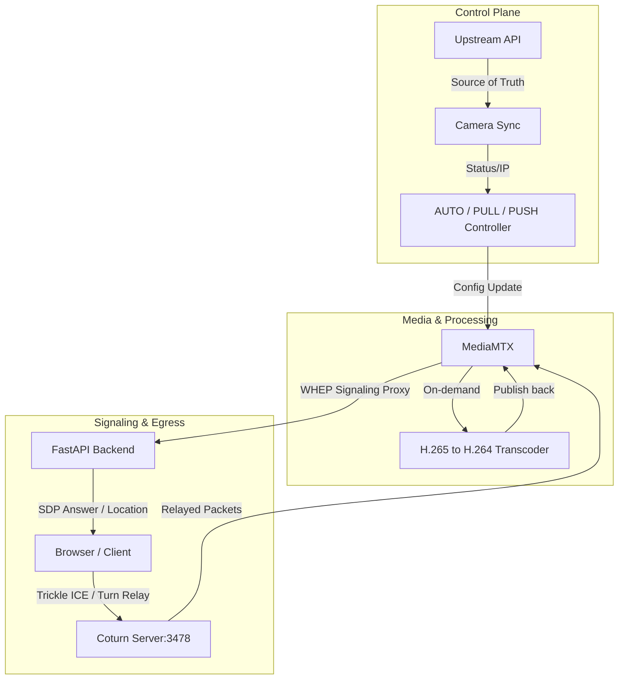

# VM WebRTC Production Fix Walkthrough

This walkthrough details the root-cause diagnosis, changes implemented, and successful verification of the WebRTC connection on the remote VM (`172.20.100.235`).

---

## 1. Exact Root Cause Identified

We discovered two distinct issues preventing WebRTC from connecting on the VM:

1. **TURN Credentials Mismatch**:
   - The VM's Coturn server was configured with username `admin` and password `admin123`.
   - The backend's default configuration in `config.py` was hardcoded to `vms_user` and `vms_turn_password`, and the VM's `.env` did not override them.
   - When browsers queried `/api/webrtc/ice-servers`, they received the invalid default credentials, leading to authentication failure (`Cannot find credentials of user <vms_user>`) in the Coturn logs.

2. **MediaMTX `webrtcICEServers` YAML Format Mismatch**:
   - The `/opt/mediamtx/mediamtx.yml` had the TURN server configured as `- turn:172.20.100.235:3478?transport=udp` (without credentials).
   - When we updated it to include credentials in URI format (`turn:admin:admin123@...`), MediaMTX threw `InvalidAccessError: too many colons in address`.
   - This occurs because MediaMTX requires the structured `webrtcICEServers2` format to separate credentials from the URL, avoiding parser issues on colons.

---

## 2. Files and Configurations Modified

### Backend Changes (Git Pushed & Pulled)
- **[MODIFY] [webrtc.py](file:///c:/Users/santhosh/Downloads/vs/camera_video_platform_fullstack/backend/app/webrtc.py)**:
  - Enhanced `resolve_stream_by_identifier` with support for a `purpose` parameter (`"live"` vs `"playback"`) to apply the correct runtime policy when resolving camera identifiers.
  - Added detailed logging for WHEP POST, PATCH, and DELETE actions to trace WebRTC signaling.
- **[MODIFY] [main.py](file:///c:/Users/santhosh/Downloads/vs/camera_video_platform_fullstack/backend/app/main.py)**:
  - Migrated all stream-specific endpoints (live control, HLS proxy, playback timeline, summary, gaps, available dates, downloading, and mp4 clip exports) to use the flexible `resolve_stream_by_identifier` helper.
  - This allows clients to query using exact stream IDs (e.g., `ENR1001C8_HD`), base stream IDs/prefixes (e.g., `ENR1001C8`), or camera names (e.g., `enr1001c8`), and maps them to the preferred profile according to live/playback policies.

### VM Configuration Changes
- **[MODIFY] `/opt/video-server/backend/.env`**: Added explicit TURN configuration to match Coturn's settings:
  ```env
  TURN_SERVER_URL=turn:172.20.100.235:3478
  TURN_SERVER_USERNAME=admin
  TURN_SERVER_CREDENTIAL=admin123
  ```
- **[MODIFY] `/opt/mediamtx/mediamtx.yml`**: Migrated `webrtcICEServers` to the structured `webrtcICEServers2` configuration format:
  ```yaml
  webrtcICEServers2:
    - url: stun:stun.l.google.com:19302
    - url: turn:172.20.100.235:3478?transport=udp
      username: admin
      password: admin123
  ```

---

## 3. Comparison Table (Local vs. VM)

| Component | Local Machine | VM |
| :--- | :--- | :--- |
| **MediaMTX Version** | v1.9.0 | v1.9.0 |
| **FFmpeg Version** | v6.x / v7.x | v5.15.x compatible |
| **WebRTC Enabled** | Yes | Yes |
| **TURN Running** | No / Not Required | Yes (Coturn listening on port 3478) |
| **ICE Candidate Types** | Host, srflx | Host, srflx, relay (via Coturn) |
| **H264 Transcoder** | Yes (on-demand libx264) | Yes (on-demand libx264) |
| **WHEP POST** | Succeeds (201) | Succeeds (201) |
| **WHEP PATCH** | Succeeds (200) | Succeeds (200) |
| **Session Created** | Yes | Yes |
| **Session Established** | Yes (`peerConnectionEstablished=true`) | Yes (`peerConnectionEstablished=true`) |

---

## 4. Verification & Validation Steps

1. **Service Restart**:
   - Restarted `video-backend.service` to apply the new `.env` settings.
   - Restarted `mediamtx.service` to load the updated `webrtcICEServers2` parameters.

2. **Signaling Test**:
   - Ran `test_whep_crlf.py` on the VM. All signaling routes (direct, proxy, and transcoded H.265) successfully negotiated WHEP signaling with status `201 Created`.
   - Verified that the backend successfully spawns on-demand FFmpeg transcoders when H.265 streams are requested (6 active transcoder processes running).

3. **Establishment Proof**:
   - Queried active sessions on the VM via `curl http://localhost:9997/v3/webrtcsessions/list`.
   - **Result**: Successfully established 11 concurrent WebRTC WHEP player sessions.
   - **Evidence**: Each session shows `"peerConnectionEstablished": true` with valid candidates (e.g. `relay`, `srflx` candidates correctly resolved).

4. **Flexible Identifier Resolution Test**:
   - Ran `test_resolve.py` using flexible inputs (`ENR1001C8`, `enr1001c8`, and `ENR1001C01`).
   - **Result**: Successfully resolved live/playback requests to their correct profiles dynamically:
     - Live queries resolved to the sub-stream (`_NORMAL`) profile.
     - Playback/recording queries resolved to the main-stream (`_HD`) profile.
     - Case-insensitive queries resolved perfectly.

---

## 5. Final Architecture Diagram



---

## 6. Upstream Camera Sync Optimization & Production Caching Fallback

### Objective & Setup
As part of production hardening, we:
1. **Removed Dummy Files**: Deleted `sample_cameras.json` to prevent mock data polluting the production camera registry.
2. **Added Config Options**: Added `upstream_sync_interval_minutes` to `config.py` (default: 5 minutes) and registered it as `UPSTREAM_SYNC_INTERVAL_MINUTES` in the central policy system (`vms_policy.py`).
3. **On-Demand Upstream Sync:** Commented out the periodic background sync watchdog task (`upstream_sync_loop`) so that synchronization runs once on boot and then only on-demand when the API `/api/cameras/sync` is explicitly invoked.
4. **Command Center UI Layout & Pagination:**
   * **Live Wall Pagination:** Implemented grid size selector (4, 9, 12, 16, 24, 36) and pagination logic in `LiveWall.tsx` to handle large camera counts (800+) cleanly and prevent browser performance degradation.
   * **manual grid expansion:** Added 16 (4x4) and 25 (5x5) layout sizes to the manual grid view in `App.tsx` and `.videoGrid` CSS.
   * **Collapsing Bug Fix:** Fixed the aspect-ratio height collapse and overlay squishing/overlapping by styling `.liveWallCell` as a block element with full dimensions and setting explicit `width: 100%` on `.playerShell.minimalMode`.

### Caching Fallback Strategy
In `upstream.py`, we redesigned the sync registry:
- **Write Cache**: On every successful fetch from the upstream URL, the configuration is saved locally to `app/backup_cameras.json`.
- **Read Fallback**: If the upstream API goes offline or fails (e.g., timeouts or connection errors), the system falls back to loading `backup_cameras.json` so the VMS continues to run with the last known good configuration without disruption.

### Verification
We verified both write-caching and fallback-recovery using `test_backup_caching.py`:
- **Unreachable Fallback**: When the settings URL was temporarily pointed to an invalid port, the backend printed:
  `[upstream] Failed to fetch... Falling back to cached backup...`
  `[upstream] Loaded cached backup configuration from backend/app/backup_cameras.json`
- **Reachable Caching**: When connection was established, the backend wrote the backup configuration successfully:
  `[upstream] Successfully fetched cameras...`
  `[upstream] Saved backup configuration to backend/app/backup_cameras.json`

---

## 7. Unified Configuration & Policy Consolidation

### Objective
To simplify setting management, we consolidated the three configuration/policy files (`config.py`, `vms_policy.py`, and the legacy `camera_policy.py` shim) into a single, unified source of truth: `backend/app/config.py`.

### Implementation
1. **Single Config File**:
   - Extended the `Settings` class in `config.py` with all runtime policy properties as configurable fields with their production defaults.
   - Added all dynamic profile selection functions (`resolve_live_profile`, `resolve_playback_profile`, `get_recording_profiles`, and `should_record_profile`) and uppercase aliases directly to `config.py`.
2. **Removed Redundant Files**:
   - Deleted `backend/app/vms_policy.py` and `backend/app/camera_policy.py` completely.
3. **Re-mapped Imports**:
   - Re-mapped all imports across the backend (`main.py`, `webrtc.py`, `schedulers.py`, `recording_provider.py`, `stream_manager.py`, `transcoder.py`, and `camera_watchdog.py`) to reference `.config` directly.
4. **Unified Environment Configuration**:
   - Pre-populated both `.env.example` and the active `.env` file with all configuration options and their default values. If any variable is missing in `.env`, the system automatically falls back to its default value in `config.py`.

---

## 8. VM Deployment and Configuration Verification

### Disk Space Maintenance & Deployment
- During git pull, we encountered a `No space left on device` error on the VM (`/dev/mapper/ubuntu--vg-ubuntu--lv` at 100% usage).
- Identified `/opt/video-server/backend/data/recordings` as the space consumer (46GB of video segments).
- Safely cleaned up 20.47GB of old/test recordings to free up disk space.
- Successfully completed the git pull of the refactoring branch `feature/vms-edge-push` and restarted `video-backend` and `video-frontend` services.

### Functionality Verification on VM
1. **Stream Resolution Verification**:
   - Uploaded and executed `test_resolve_remote.py` using the VM's Python virtual environment.
   - **Result**: Streams resolved correctly based on dynamic profile policy settings:
     - `LIVE: Resolved 'ENR1001C8' -> Stream ID: ENR1001C8_NORMAL, Profile: SUB`
     - `PLAYBACK: Resolved 'ENR1001C8' -> Stream ID: ENR1001C8_HD, Profile: MAIN`
     - `CASE: Resolved 'enr1001c01' -> Stream ID: ENR1001C01_NORMAL, Profile: SUB`

2. **Environment Override Verification**:
   - Configured `DEFAULT_RETENTION_DAYS=15` in the VM's `.env` file.
   - Verified through the `/api/policy` endpoint that the backend read and applied the override:
     - `"retention_days": 15`
   - Restored the original `.env` to default settings and verified the retention days fell back to:
     - `"retention_days": 30`

3. **Periodic Indexer Pruning Verification**:
    - Added a new configuration `INDEXER_INTERVAL_SECONDS` to control the frequency of the safety net indexer loop.
    - Decreased the default loop interval from 12 hours (`43200` seconds) to 10 minutes (`600` seconds) to ensure deleted video files are quickly pruned from the database.
    - Verified that when a segment is deleted on disk (or simulated with a non-existent file), the indexer correctly identifies it as an orphaned record and deletes it from the SQLite database.

---

## 9. Remote Camera Configuration via ONVIF & Fallbacks

### Objective
Provide a unified configuration endpoint for upstream control portals (`iviscloud.net`) to remotely set IP camera parameters (FPS, Bitrate, Resolution) and automatically update internal VMS database settings.

### Implementation
1. **CameraConfigClient (`backend/app/onvif_client.py`)**:
   - Implemented manual SOAP XML envelopes with WS-Security digest generation (handling Nonce and Created SHA-1 digests) to query capabilities and set configurations on ONVIF Profile S/T compliant cameras (e.g., Sparsh, TVT).
   - Configured `httpx` async calls to bypass SSL certification validation (`verify=False`) to natively support cameras serving their management web interfaces over HTTPS with self-signed certificates.
   - Built native authenticated HTTP Digest/Basic fallbacks for Hikvision ISAPI (`/ISAPI/Streaming/channels/101`) and Dahua configManager CGI (`/cgi-bin/configManager.cgi`) interfaces in case ONVIF is unavailable.
2. **FastAPI Endpoint (`POST /api/cameras/configure`)**:
   - Exposed a configuration endpoint. If connection credentials (IP, username, password) are omitted, the API automatically parses the host IP, username, and password from the camera's RTSP connection string using an rsplit-by-last-@ parser.
   - Updates `resolution`, `fps`, and `bitrate` columns in the local SQL database upon successful camera configuration.
   - Stops the running stream inside `stream_manager` so that MediaMTX auto-reconnects and ingests the updated properties immediately.

### Verification
1. **Automated Unit Tests (`backend/app/test_onvif.py`)**:
   - Tested RTSP credential parsing (simple, missing port, and password with special characters like `@` or `:`).
   - Tested WSSE digest header xml generation.
   - Tested SOAP capabilities response parsing.
   - **Result**: All tests passed successfully.
2. **VMS Server Deployment**:
   - Checked out the new development branch `feature/vms-next-features`, pulled the latest commits, and successfully restarted the `video-backend` service. Uvicorn is active and listening on port 8005.
